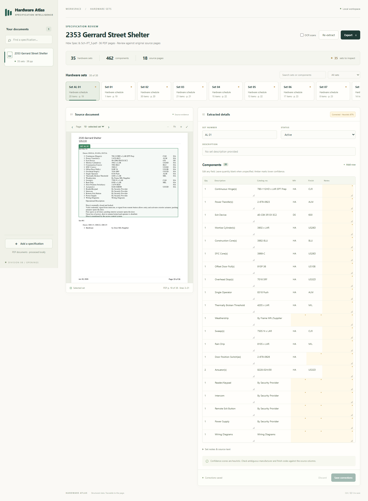

# Hardware Atlas

Extract construction hardware sets from PDFs, inspect each result beside its source, and save corrections. Built for the Fresco Hardware Sets challenge.

**Local-first. No API keys, paid model calls, or external document uploads.** The application uses native PDF geometry, contextual column inference, and a state machine for page continuations.



## Run locally

Requires Python 3.10+; tested on Windows with Python 3.13. The local application is the deployment deliverable.

```powershell
python -m venv .venv
.venv\Scripts\python.exe -m pip install -r requirements.txt
.venv\Scripts\python.exe -m hardware_sets serve --port 8000
```

Open **http://127.0.0.1:8000**. Upload a PDF and extract it. Select a set to view its highlighted source, edit fields, add/remove component rows, save corrections, and export JSON or CSV. Leave quantity blank when unspecified.

On macOS/Linux, substitute `.venv/bin/python` for `.venv\Scripts\python.exe`. Run commands from the repository root. No JavaScript build step is needed.

### Load the supplied corpus

Keep the downloaded folder beside this README, or supply its actual path:

```powershell
.venv\Scripts\python.exe -m hardware_sets corpus "Fresco Coding Challenge (Hardware Sets)" --output output/corpus --register
.venv\Scripts\python.exe -m hardware_sets serve --port 8000
```

The corpus command writes one JSON per PDF plus `output/corpus/summary.json`, continues past individual file errors, and registers results in the review app. The supplied download contains **43 PDFs / 21 project folders / 17,637 pages**, including supporting sections and repeated schedules. The initial full run took about six minutes on this workstation; hardware and PDF complexity affect runtime.

Source PDFs and local application data are deliberately excluded from Git. Registration references original PDFs, so keep those files in place. Uploads are copied into the application store. Use `--data-dir path/to/store` with `corpus --register` and `serve` to choose another store.

### Extract a file or selected pages

```powershell
.venv\Scripts\python.exe -m hardware_sets extract "input.pdf" --output output/result.json
.venv\Scripts\python.exe -m hardware_sets extract "input.pdf" --pages 19-21,25 --output output/selected.json
```

Pages are **physical PDF pages, starting at 1**. Include the preceding page when a selection begins inside a set. The parser does not invent a missing header outside the selected range.

## Output contract

Each `sets[]` entry contains:

| Field | Meaning |
|---|---|
| `set_number` | Printed identifier as a string, preserving leading zeros and alphanumeric/decimal IDs |
| `description` | Optional heading text |
| `status` | `active` or `not_used`; unused sets retain an empty component list |
| `locations[]` | One span per source page: `page`, `bbox`, page dimensions, and physical line range |
| `components[]` | `qty`, `description`, `catalog_number`, `mfr`, `finish`, `notes`, source evidence, and an optional `catalog_resolution` |
| `confidence`, `warnings` | Heuristic review scores and concrete extraction issues |

Bounding boxes are `[left, top, right, bottom]` in PDF points, with a top-left origin. Multiple locations preserve multi-page sets. Components also retain their own boxes, `raw_text`, `qty_raw`, and unit where available. Missing quantities are `null`; fractions remain printed strings instead of being converted into an assumed unit.

See [the generated JSON schema](docs/output.schema.json) and [an actual extracted example](examples/example-set.json).

## Approach and tradeoffs

1. **Read and route pages.** Scan the text layer, identify strong set headings, and preserve continuation state. Detect text-poor pages and report them separately. Supporting door indexes are not component schedules.
2. **Reconstruct evidence.** Group positioned words into physical lines. Remove rotated margin watermarks and private-use link/electrification glyphs without shifting adjacent finish values into another column.
3. **Infer the schema before codes.** Explicit headers take priority. Otherwise, use repeated horizontal alignments, neighboring rows, local manufacturer legends, and distributions of recognizable values. `PE` and `NO` are deliberately excluded from standalone manufacturer/finish evidence; an established column role assigns them.
4. **Segment sets and rows.** Preserve wrapped/centered cells, null quantities, unused sets, aliases, header-only page endings, and page continuations. Stop at a new specification section. A separate generic grid parser handles merged `SET / HARDWARE TYPE / MANUFACTURER - PRODUCT / QTY / FINISH / NOTES` tables.
5. **Resolve explicit page-local codes.** When a page contains a labeled code table or legend, preserve the printed short code and attach its expanded description, catalog, manufacturer, finish, confidence, and lookup-table location. Isolated short codes are never expanded by guesswork.
6. **Review instead of hiding uncertainty.** Display original pages, field scores and warnings. Store human corrections separately from original extraction, with an audit history. Exports include corrections and page-local code expansions.

This approach is fast, reproducible, inspectable, and inexpensive. It avoids relying on a model to invent coordinates or resolve each short code in isolation. Its tradeoff is layout-specific heuristics: unusual unruled tables, malformed text layers and revision graphics can still require review. See [architecture](docs/ARCHITECTURE.md) and the [file-by-file corpus audit](docs/CORPUS_AUDIT.md).

## Verification

```powershell
.venv\Scripts\python.exe -m pip install -r requirements-dev.txt
.venv\Scripts\python.exe -m pytest -q
.venv\Scripts\python.exe -m hardware_sets evaluate --gold tests/fixtures/development_gold.json --corpus output/corpus --output output/evaluation-development.json
.venv\Scripts\python.exe -m hardware_sets evaluate --gold tests/fixtures/project_sample.json --corpus output/corpus --output output/evaluation-project-sample.json
.venv\Scripts\python.exe -m hardware_sets evaluate --gold tests/fixtures/heldout_gold.json --corpus output/corpus --output output/evaluation-heldout.json
.venv\Scripts\python.exe -m scripts.evaluate_holdout_locations
.venv\Scripts\python.exe -m scripts.evaluate_holdout_components
```

Without a corpus run, replace `--corpus output/corpus` with `--source "Fresco Coding Challenge (Hardware Sets)"` to evaluate only labeled pages.

- **Development sample:** 18 sets / 91 components / 8 documents, including missing quantities, centered multiline cells, an unused set, merged tables and a page continuation.
- **Additional project sample:** 9 sets / 51 components / 3 further documents, transcribed before inspecting predictions for those pages. These share familiar vendor templates and are not a template-disjoint benchmark.
- **Frozen holdout:** eight pages from eight other layout families, with 14 sets and 126 independently transcribed components. The first full-corpus run matched 14/14 sets and 126/126 expected components, produced three extra rows, and matched 123/126 complete annotated rows exactly (97.6%), with zero manufacturer/finish swaps. Separate location checks cover all 17 printed headings and all 126 labeled component rows on the holdout pages and adjacent continuation pages.
- **Manual acceptance pass:** [render-backed review](docs/validation/MANUAL_ACCEPTANCE.md) screened 102 pages across schedule families and found zero structural or visual discrepancies in the saved results. It records the limits of that review rather than treating it as full-row ground truth.
- **Exhaustive source grounding:** [all 11,622 rows](docs/validation/CORPUS_SOURCE_GROUNDING.md) have valid source boxes; every description and every non-null catalog, manufacturer, and finish value is present in its source box.
- **Exhaustive semantic proxy:** [manufacturer/finish geometry](docs/validation/CORPUS_SEMANTIC_PROXY.md) was independently checked for all 11,622 rows with zero column-role exceptions.
- Both selected-page checks found all annotated sets/components and matched all annotated component fields, with zero manufacturer/finish swaps. See [validation scope and results](docs/VALIDATION.md).
- Automated tests cover ambiguous codes under opposite column orders, page boundaries, missing quantities, unused sets, strikeouts versus underlines, API persistence and one-to-one evaluation matching. A browser smoke test exercises editing, saving, exports, source overlays, error recovery and a 390-pixel mobile viewport.

**The frozen holdout exceeds 90% on the measured sample; it cannot guarantee 90%+ across every row of all 43 PDFs.** Full processing coverage is not accuracy. Evaluation counts missing rows against every annotated field and never reuses one predicted row to satisfy duplicate expected rows. Set precision is measured separately on an exhaustive 17-heading holdout scope.

## Known limits

- OCR requires a separate Tesseract installation and English language data. Add `--ocr`, or use the UI checkbox, to attempt OCR on text-poor pages. Native-text results were verified here; OCR accuracy was not benchmarked. Blank pages and scanned catalog attachments are also reported as text-poor.
- Strikeout handling recognizes horizontal vectors and thin filled rectangles. Raster strikeouts, partial-word revisions and other revision conventions need manual review.
- Code expansion requires an explicit table or legend on the same PDF page. Cross-page legends, informal prose definitions, and external manufacturer catalogs are not applied automatically.
- Scores are heuristic, not calibrated correctness probabilities. Absence, uncertain boundaries and unfamiliar layouts require source review.
- Repeated source PDFs and repeated set IDs remain separate occurrences. Revisions are not automatically reconciled across different files.
- This is a single-user local app. It binds to loopback by default; multi-user hosted deployment would need authentication, background jobs and a shared database.

## Demo and repository map

Use the [3–5 minute walkthrough](docs/DEMO.md). The prepared local demo video is `output/demo/hardware-atlas-demo.mp4`; attach it directly to the submission email. It demonstrates actual local results, not a hosted deployment.

```text
hardware_sets/       extraction, schema, storage, API, CLI, evaluation
hardware_sets/static/  standalone review interface
tests/              behavioral/API/evaluation tests and source-transcribed labels
scripts/            corpus inventory, browser verification, demo tooling
docs/               architecture, corpus audit, validation, walkthrough, schema
examples/           small real extraction example
output/             local corpus results, evaluations and demo (not committed)
```

## License

Project code is provided under AGPL-3.0-or-later; see [LICENSE](LICENSE). PyMuPDF uses AGPL/commercial licensing. See [third-party notices](THIRD_PARTY.md). Input specification documents are not licensed by this repository and are not included in its source distribution.
