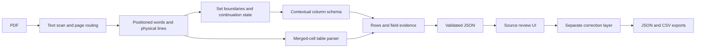

# Architecture and engineering decisions

## Data flow

`layout.py` owns PDF geometry. `extract.py` owns header classification, schema inference and stateful assembly. `table_schedule.py` handles the explicit merged-grid family. Both return the same Pydantic contract. `storage.py` owns source registration, atomic writes and corrections. `api.py` and `cli.py` are adapters, not alternate extraction implementations.

## Why column context comes first

Manufacturer and finish codes overlap. A dictionary lookup of `PE` alone is insufficient. The parser first looks for explicit headers and otherwise collects consistent positions across component rows. Strong manufacturer examples and strong finish examples establish column roles; ambiguous tokens do not vote for a role themselves. A confirmed column then carries `PE` as the printed value of that field. Neighboring sets can supply the same aligned schema when a short set has insufficient evidence. Reordered explicit columns override previous schema state.

This is a deterministic heuristic, not a universal table recognizer. A single-column prose schedule can preserve an item without asserting separate catalog or manufacturer fields. Field-level scores and raw source text remain available for review.

## Boundaries and identity

IDs derive from source hash, page, header position and printed set number. They do not collapse distinct occurrences with the same number. Shared headings such as B1/B2 produce separate set records linked to the same evidence. A set continuing on a later page retains one ID and multiple page locations.

Headers that only appear at the bottom of a page are retained. A new specification section terminates continuation. A door-to-set index is not a component schedule. Sets explicitly marked unused remain visible; an absent number in a sequence does not create an invented unused set.

Rotated watermark text is excluded from physical line reconstruction. Private-use glyph removal also corrects the word box so a lightning icon fused to `689` does not place the finish in the preceding catalog column. Horizontal strikeout geometry is distinguished from underlining by its intersection with glyph height.

## Corrections and storage

The local store contains metadata, untouched extraction JSON and a separate correction/audit record. Writes use a temporary file and atomic replacement. The UI sends complete edited sets, retaining source evidence for existing rows. A corrected result does not erase the original extraction.

Source paths are registered internally and selected by opaque IDs. Browser requests cannot choose arbitrary filesystem paths. Uploaded PDFs are validated and bounded in size; page rendering is bounded in resolution. CSV export protects cells that spreadsheet software could interpret as formulas. Sync API endpoints keep blocking PDF operations outside the async event loop. The default deployment remains one local user on loopback.

## Costs and scaling

There are no model-inference or API costs. Full text scanning is linear in page count; detailed geometry is read only on candidate/continuation pages. Grid detection is gated by a specific column-header signature. Large PDF rendering and extraction are CPU work, so a production service should move them into bounded worker processes and cache images/results by document hash and engine version.

## Deliberate omissions

Explicit same-page code tables and legends can expand shorthand component codes while retaining both the printed value and the lookup location. Cross-page or external catalog resolution, automated cross-file revision precedence, calibrated confidence, and multi-user authentication remain outside the automatic path. OCR uses PyMuPDF's Tesseract integration when explicitly requested; it is not silently treated as equivalent to verified native text. The corpus audit and evaluation fixtures expose what was inspected rather than claiming unmeasured generalization.

## Primary references

- [PyMuPDF text extraction](https://pymupdf.readthedocs.io/en/latest/recipes-text.html)
- [PyMuPDF OCR](https://pymupdf.readthedocs.io/en/latest/recipes-ocr.html)
- [pdfplumber geometry/table APIs](https://github.com/jsvine/pdfplumber), considered during research; not required at runtime
- [Tesseract quality guidance](https://tesseract-ocr.github.io/tessdoc/ImproveQuality.html)
